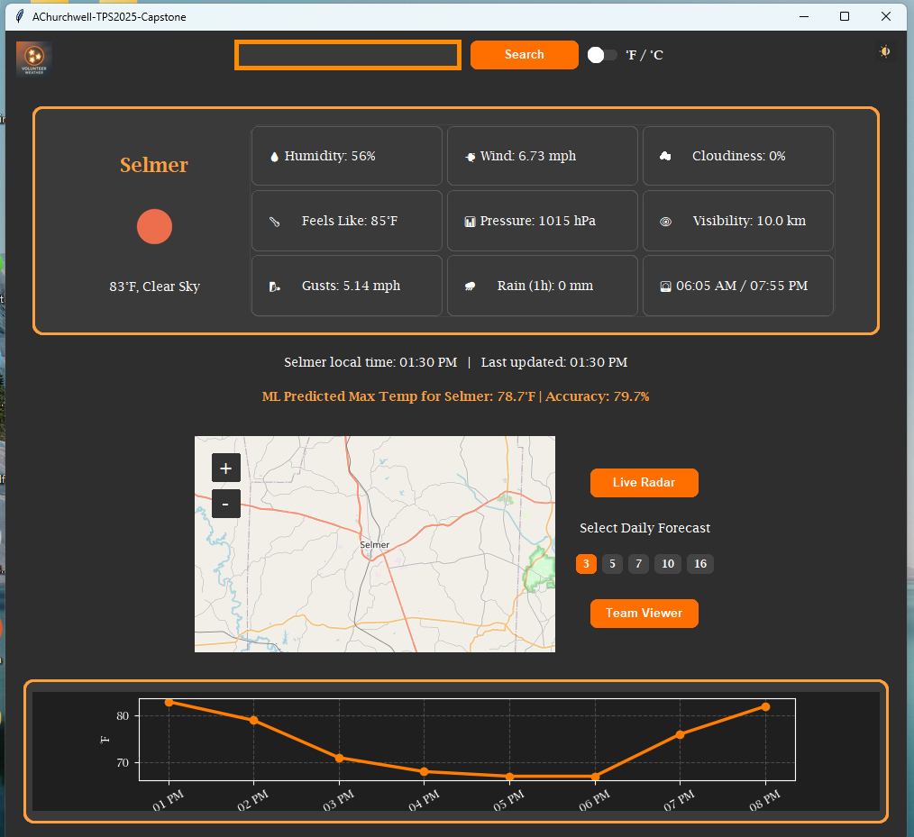

  

<h1 align="center">Tech Pathways Notes</h1>

This repository contains my notes, practice exercises, and projects from the **Justice Through Code – Tech Pathways program**.  
It documents my progress in Python fundamentals, algorithms, data cleaning, statistics, and project work leading up to AISE.

## 🙋 About This Repo
This repo is a record of my learning journey through the **Justice Through Code – Tech Pathways** program.  
Each week built on the last: starting from Python basics, moving into data cleaning and visualization, and finishing with a capstone project that ties everything together.

---

## 🌦️ Capstone Highlight
My final project, **Volunteer Weather**, is a Python & Tkinter weather dashboard that includes:
- Real-time weather data from the OpenWeather API  
- Custom GUI with dark/light mode  
- Interactive maps and radar  
- Forecast charts and CSV export  
- A machine learning model for Selmer, TN max temp predictions 

  

---

## 📖 Table of Contents
- [Practice Examples](#practice-examples)
- [Weekly Folders](#weekly-folders)
  - [Week One](#week-one)
  - [Week Two](#week-two)
  - [Week Three](#week-three)
  - [Week Four](#week-four)
  - [Week Five](#week-five)
  - [Week Six](#week-six)
  - [Week Seven](#week-seven)
  - [Week Eight](#week-eight)
  - [Week Nine](#week-nine)
  - [Week Ten](#week-ten)
  - [Week Eleven](#week-eleven)
  - [Week Twelve](#week-twelve)
  - [Week Thirteen](#week-thirteen)
  - [Week Fourteen](#week-fourteen)
  - [Week Fifteen](#week-fifteen)
  - [Week Sixteen](#week-sixteen)
  - [Week Seventeen](#week-seventeen)
- [Capstone Playground](#capstone-playground)

---

## 📝 Practice Examples
- `practiceExamplesFolder/` → drills for functions, loops, dictionaries, sets, error handling, and APIs  
- `practice/` → small one-off scripts and warm-ups  

---

## 📂 Weekly Folders
Each folder contains exercises, assignments, and notes from that week of the program.

### Week One
- Functions, dictionaries, sets  
- Importing modules  
- Debugging and exceptions  
- Web API basics  

### Week Two
- Nested data structures  
- Intro to OOP  
- API calls and JSON handling  
- Project organization  

### Week Three
- Algorithmic thinking notes  
- Sorting basics & efficient sorting  

### Week Four
- Data cleaning exercises  
- Data visualization with Matplotlib  
- Weather data analysis  

### Week Five
- Statistics and probability  
- Pandas operations and in-class drills  

### Week Six → Week Seventeen
- Expanding into advanced Python, data science, and machine learning foundations (contents in each folder)  

---

## 🛠️ Skills Practiced
- Python fundamentals (functions, loops, data structures, error handling)  
- Algorithmic thinking & sorting methods  
- Data cleaning and preprocessing  
- Pandas & NumPy for analysis  
- Matplotlib for visualization  
- Statistics & probability foundations  
- SQLite for lightweight data storage  
- Intro to machine learning with scikit-learn 

---

## 🔬 Capstone Playground
`capstonePlayground/` → experimental scripts and prototypes for my **Volunteer Weather** capstone project.  

---

## 🐼 Pandas Quick Reference
`pandas_Quick_.../` → cheatsheets, example notebooks, and helper scripts for Pandas.  

---

## 🚀 Next Steps
- Continue practicing **pandas + matplotlib** for data analysis  
- Add more **algorithm notes and implementations**  
- Begin **machine learning foundations** prep for AISE  

---

## ⚙️ Tech Stack
- Python 3.x  
- Pandas, NumPy, Matplotlib  
- SQLite for lightweight storage  

---

## 📌 Notes
Sensitive files (API keys, databases, raw datasets) are excluded via `.gitignore`.  

---

## 📜 License
This repo is for educational purposes only.  

## 🙏 Acknowledgments
Special thanks to **Justice Through Code** instructors, mentors, and peers for their support.  

## 🌐 Links
- [Justice Through Code Program](https://justicethroughcode.org/)  
- [Columbia University](https://www.columbia.edu/)  
- 
  

  

